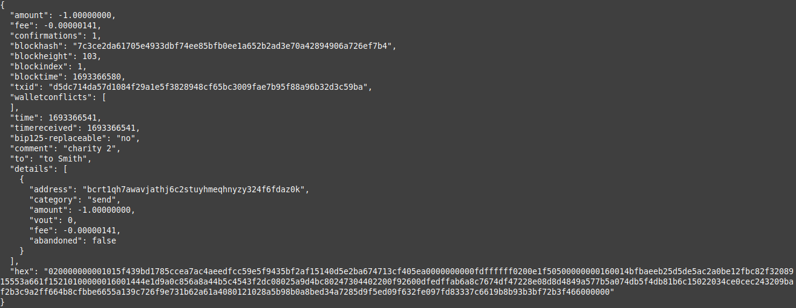
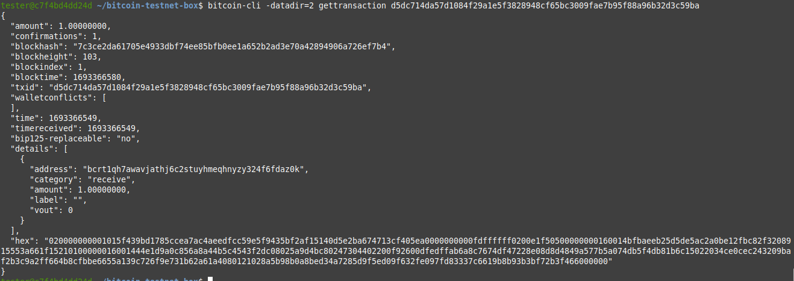

Було запущено докер контейнер [freewil/bitcoin-testnet-box](https://github.com/freewil/bitcoin-testnet-box)

Було створено дві ноди за допомогою команди `make start` (ця команда запускає в режимі демона програму bitcoind двічі)

Створено два гаманці на двох нодах в середини тестової біткоїн мережі.

Далі було створено [гіт репозиторій](https://github.com/alexmazaltov/bitcoin-test-net-history), щоб відслідковувати зміни в децентралізованій базі данних цієї тестової мережі.

Далі було створено декілька блоків на 1-й ноді і декілька блоків на 2-ноді.

Виконуючи інструкцію було усвідомлено багато різних речей, досліджено документацію роботи програми bitcoind. [Деталі досліження](https://chat.openai.com/share/673211a1-655d-4a25-a91c-b1188681a59a)

Було досягнуто умови, щоб зарахована винагорода майнера в транзакції у першому блоці була визначена як matured 

Було здійснено перевод з одного гаманця на інший.

Було створено новий блок, щоб транзакції з мем-пула (а саме про передачу 1 біткоіна) потрапили в децентралізовану базу даних шляхом запису хешу транзакції в новостворений блок.

Було цікаво дізнатися, що інформація про транзакцію про передачу на ноді відправника дещо відрізняється від інформації про ту ж транзакцію на ноді отримувача: 

# Транзакція про передачу 1 біткоіна на ноді відправника

# Транзакція про передачу 1 біткоіна на ноді отримувача

Варто звернути увагу, що значення в полі hex в описі транзакції однакове для обох нод, але інформація в інших полях опису транзакції відрізняється.

Також варто відзначити що в [debug.log першої ноди](https://github.com/alexmazaltov/bitcoin-test-net-history/blob/2df3ea9e3c21f17027e91d09b194c1cd6d3a1a2e/1/regtest/debug.log#L196) часто зустрічається повідомлення про stale tip.

І останнє на що хотілося б звернути увагу це на [повідомлення про коміт транзакції](https://github.com/alexmazaltov/bitcoin-test-net-history/blob/2df3ea9e3c21f17027e91d09b194c1cd6d3a1a2e/1/regtest/debug.log#L536). Це повідомлення присутнє в debug.log лише на ноді відправника, думаю це говорить про те що демон bitcoind що працював на сервері і відповідав за дані у файлах директорії ноди відправника виконав коміт після того як було підтверджено іншою нодою створення чергового блока з хешем транзакції про передачу криптовалюти.